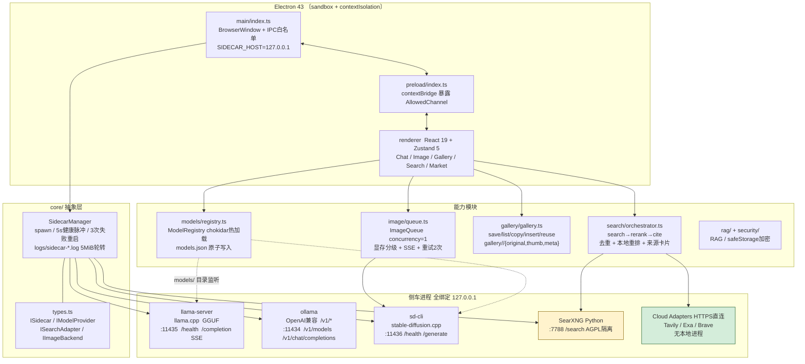
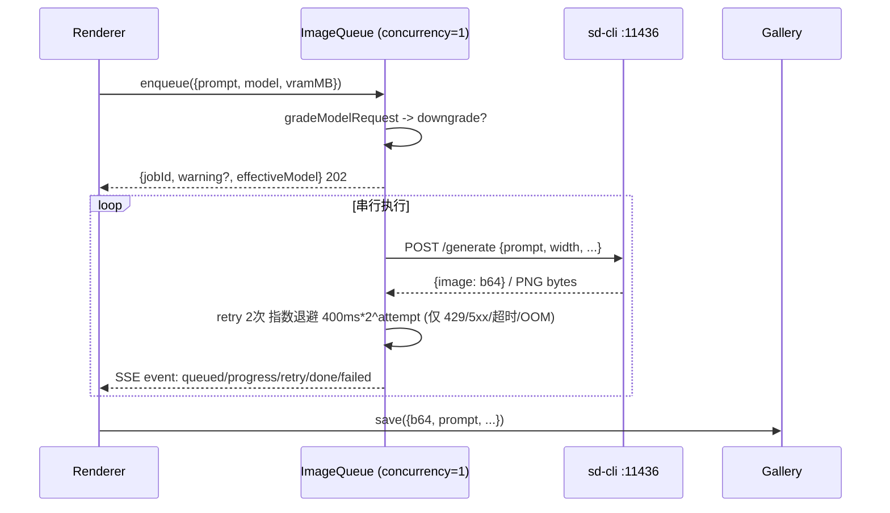
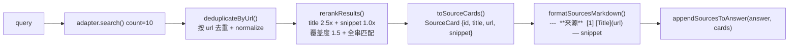

# ARCHITECTURE — Local AI Suite

> Electron 43 + React 19 桌面壳，所有推理/生图/搜索均在 `127.0.0.1` 本地闭环。主进程绝不链接 AGPL 组件，AGPL 仅以独立子进程运行于 `sidecars/`。

---

## 1. 总览图



> 图例：黄色 `SearXNG` 为 AGPL 隔离侧车，绿色 `Cloud` 为远程 HTTPS（非侧车）。

---

## 2. 侧车契约与生命周期

### 2.1 统一接口 `ISidecar`

```ts
// src/core/types.ts
interface ISidecar {
  name: string          // 逻辑名 -> logs/sidecar-<name>.log
  bin: string           // 二进制路径
  args: string[]        // 含 --host 127.0.0.1 --port <port>
  port: number          // 1024-65535
  healthUrl: string     // 必须 http://127.0.0.1:<port>/...
}
interface IModelProvider extends ISidecar { modelPath?: string; generate?(); chat?() }
interface ISearchAdapter extends ISidecar { search?() }
interface IImageBackend  extends ISidecar { generate?() }
```

所有 `healthUrl` 在 `SidecarManager` 构造时强制校验 `hostname === 127.0.0.1`，违规则抛错。

### 2.2 SidecarManager 状态机

```
                    ┌─────────────┐
                    │   stopped   │◄────────────┐
                    └──────┬──────┘             │
                           │ start()            │ stop()
                           ▼                    │
                    ┌─────────────┐      ┌─────────────┐
                    │   running   │─────►│  restarting │
                    └──────┬──────┘      └──────┬──────┘
                           │                    │
              healthCheck()│  fail 3/3          │ failures=0
              5s pulse     └────────────────────┘
```

| 能力 | 默认值 | 说明 |
|------|--------|------|
| 健康脉冲 | `HEALTH_INTERVAL_MS = 5_000` | `setInterval` 轮询 `healthUrl` |
| 失败阈值 | `MAX_FAILURES = 3` | 连续失败 3 次触发 `restart()` |
| 日志 | `logs/sidecar-<name>.log` | 5 MiB 触发轮转 → `.1` |
| 探针超时 | `2_000 ms` | `AbortController` 超时 |
| 未填隐藏 | 云搜索 key 为空时隐藏 | `hideUnconfigured=true` |

### 2.3 端口分配

| 侧车 | 二进制 | 端口 | 健康检查 | 生成/搜索端点 |
|------|--------|------|----------|---------------|
| llama.cpp | `llama-server` (`LLAMA_BIN`) | `11435` | `GET /health` | `POST /completion` SSE |
| Ollama | `ollama` | `11434` | `GET /v1/models` | `POST /v1/chat/completions` |
| sd.cpp | `sd-cli` (`SD_BIN`) | `11436` | `GET /health` | `POST /generate` |
| SearXNG | `python -m searxng` | `7788`（默认，可设置覆盖） | `GET /healthz` | `GET /search?q=` |
| Cloud | 无进程 (HTTPS) | — | — | 供应商 API |

所有端口通过环境变量或 `Create*Options.port` 覆盖，但 `host` 永远 `127.0.0.1`。

---

## 3. 模型文件夹

### 3.1 目录约定

```
models/                          # .gitignore 已忽略，绝不入库
  models.json                    # ModelRegistry 原子写入的索引
  models.json.tmp                # 写入期临时文件
  llm/qwen3-4b-instruct-Q4_K_M.gguf
  embedding/bge-m3/
  diffusion/sd15-Q4_0.gguf
  sd-v1-5-pruned-emaonly.safetensors
```

### 3.2 ModelRegistry 热加载

`src/models/registry.ts` — `ModelRegistry` 负责：

- **监听**：`chokidar` 深度 10 层，`awaitWriteFinish` 稳定 300 ms，`add/change/unlink/addDir/unlinkDir` → 120 ms debounce `scan()`。
- **识别**：`detectQuant()` 匹配 `Q4_K_M/Q8_0/F16/...`，`detectArch()` 匹配 `qwen3/llama/mistral/...`，`detectFormat()` 按扩展名分 `gguf/safetensors/onnx/bin`。
- **探针**：`<1 KB` 文件读 4 字节 GGUF magic `GGUF`，失败则隔离不入表。
- **持久化**：`JSON.stringify(models, null, 2)` → `models.json.tmp` → `renameSync` 原子落盘；损坏的 `models.json` 返回 `[]` 不崩。
- **失败隔离**：单文件 `stat/read` 失败仅 `warn`，目录不可读跳过，listener 抛错被捕获。

```ts
const reg = new ModelRegistry('./models')
await reg.startWatch()
reg.onUpdate(models => ui.refresh(models))
reg.scan()          // 同步全量
reg.reloadModels()  // 同步重扫 + 原子写
```

---

## 4. 生图链路

### 4.1 sd.cpp 侧车

`src/sidecars/sd.ts`：

- `buildSdArgs({ modelPath, quantization, cpuFallback, device, threads })` 拼 `sd-cli` 参数，含 `--weight-type q4_0` / `--cpu` / `--device cuda|vulkan`。
- `SdQueue` 串行队列 `enqueue(fn)` 保证 `POST /generate` 不并发压爆显存。
- `generateWithCpuFallback()` 首试 GPU，匹配 `cuda/vulkan/gpu/oom/out of memory/ggml.*failed` 则用 `fallbackFetch` 重试一次（CPU 回退）。
- `SdSidecar` 包装 `SidecarManager + SdQueue + generate()`，每实例私有队列。

### 4.2 ImageQueue 显存分级

`src/image/queue.ts`：

| 显存 | 分级 | 策略 |
|------|------|------|
| `<4 GB` | `low` | 强制 `sd1.5-q4` (`q4_0`) |
| `<6 GB` | `medium` | `SDXL` 警告，建议 `512x512 / steps≤20` |
| `6-12 GB` | `high` | `SDXL` 正常 |
| `>12 GB` | `ultra` | 解锁 `FLUX` |

`gradeModelRequest(vramMB, requestedModel)` → `ModelRequestGrade { allowed, downgraded, warning, effectiveModel }`。

### 4.3 队列与 SSE



- `POST /api/image/generate` 或 `POST /v1/images/generations` → `enqueue` 返回 `202 {jobId}`。
- `GET /api/image/queue/:id/stream` 与 `GET /api/image/queue/stream` 为 `text/event-stream`，心跳 `: keep-alive` 15 s。
- `toSseResponse(jobId?)` 与 `sseForJob(id)` 直接返回 `Response` 可挂到 `fetch` handler。

### 4.4 画廊落盘

`src/gallery/gallery.ts` — 动词五件套：

| 动词 | 入口 | 产物 |
|------|------|------|
| `save` | `save({b64, prompt, ... , baseDir?, id?})` | `gallery/<id>/original.png` + `thumb.png` + `meta.json` |
| `list` | `list({baseDir})` | 按 `createdAt` 倒序的 `GalleryItem[]` |
| `copy` | `copy(id)` | `CopyPayload {path, b64, mime}` + 尽力写 `electron.clipboard` |
| `insert` | `insert(id, onInsert?)` | `InsertPayload {text, imagePath, b64, prompt}` 插入聊天 |
| `reuse` | `reuse(id)` | `ReuseParams` 直接喂回 `/generate` |

---

## 5. 搜索链路

### 5.1 适配器层

| 适配器 | 文件 | 协议 | 鉴权 |
|--------|------|------|------|
| `SearXNG` | `search/searxng.ts` | `GET http://127.0.0.1:7788/search?q=`（默认，可设置覆盖） | 无 |
| `Tavily` | `search/cloud.ts` | `POST https://api.tavily.com/search` | `TAVILY_API_KEY` |
| `Exa` | `search/cloud.ts` | `POST https://api.exa.ai/search` | `x-api-key: EXA_API_KEY` |
| `Brave` | `search/cloud.ts` | `GET https://api.search.brave.com/res/v1/web/search` | `X-Subscription-Token: BRAVE_API_KEY` |

所有云适配器实现 `ISearchAdapter`，未配置 key 时 `isConfigured=false`，`createCloudAdapters({hideUnconfigured:true})` 隐藏。费率提示 `CLOUD_COST_HINTS` 直接展示在设置页。

### 5.2 Orchestrator 链路

`src/search/orchestrator.ts` — `search → dedup → rerank → cite → markdown`：



- `scoreItem(query, item)` 确定性本地打分，含 `tokenize` / 中文整词处理。
- 可注入 `reranker?: (query, items) => RankedItem[]` 覆盖内置。
- `SearchOrchestrator.search(query)` 一步返回 `{raw, deduped, ranked, cards, markdown}`；`searchAndAppend(query, answer)` 直接拼接回答。

---

## 6. 集成：OpenCode / Continue

本地 OpenAI 兼容层 `http://127.0.0.1:11434/v1` 由 `Ollama` 侧车（或 `llama-server` 的 `/v1` 兼容封装）提供，`apiKey` 任意非空（约定 `ollama`），零鉴权。

详见 `docs/integrations/opencode.md` 与 `docs/integrations/examples/`：

- `opencode.json` → `provider.openai.baseURL = http://127.0.0.1:11434/v1`
- `~/.continue/config.yaml` → `models[].apiBase = http://127.0.0.1:11434/v1`
- 冒烟：`curl http://127.0.0.1:11434/v1/models` / `POST /v1/chat/completions` / `POST /v1/embeddings`

---

## 7. 渲染层与 IPC

- `src/main/index.ts`：`BrowserWindow` 5 项安全基线 `sandbox/contextIsolation/nodeIntegration=false/webSecurity/allowRunningInsecureContent=false`，`setPermissionRequestHandler(()=>false)`，`setWindowOpenHandler({action:'deny'})`。
- `src/main/ipc/whitelist.ts`：`AllowedChannel = 'health:pulse'|'models:list'|'models:download'|'chat:send'|'image:generate'`，`registerIpcHandlers()` 双重校验。
- `src/renderer/`：`React 19 + Zustand 5`，`electron-vite` 双编译（`main`/`preload`/`renderer`）。

---

## 8. 目录结构

```
local-ai-suite/
  src/
    core/           # SidecarManager + ISidecar契约
    sidecars/       # llama.ts / ollama.ts / sd.ts
    models/         # ModelRegistry 热加载
    image/          # ImageQueue 显存分级 + 重试 + SSE
    gallery/        # 画廊五动词
    search/         # searxng.ts / cloud.ts / orchestrator.ts
    rag/ theme/ chat/ market/ onboarding/ health/
    main/           # BrowserWindow + IPC + tray + shortcuts
    preload/        # contextBridge
    renderer/       # React 入口与页面
    shared/         # 共享类型与常量
  docs/
    ARCHITECTURE.md # 本文件
    COPYING.md      # 抄用标注与合规边界
    SECURITY.md     # 密钥存储与轮转
    integrations/   # OpenCode/Continue 联调文档与示例
  scripts/
    check-licenses.mjs  # 许可白名单门禁 + SBOM
    check-pack-size.mjs # 安装包体积预算
  electron.vite.config.ts
  electron-builder.yml  # asar / files白名单 / nsis/dmg/AppImage
```

---

## 9. 打包与体积

- `electron-builder.yml`：`asar:true`，`asarUnpack: **/*.node/**/*.dll/**/*.so`，`compression: maximum`，`files` 白名单排除 `*.ts/*.map/*.md/docs/coverage/.omo/models/*.gguf` 等，永不打包本地权重。
- 原生模块 `better-sqlite3/sqlite-vec/sharp` 按 `pnpm.onlyBuiltDependencies` 在目标 OS 上 `electron-builder install-app-deps` 重建，仅打包当前平台二进制。
- 预算：Windows `nsis x64` 不含模型 `<150 MB`，由 `scripts/check-pack-size.mjs` 门禁。

---

## 10. 安全与合规速览

- 密钥（`hfToken` / `TAVILY_API_KEY` 等）经 `safeStorage` (DPAPI/Keychain/libsecret) 加密为 `enc:v1:<base64>` 落盘，`maskSecret()` 脱敏展示，日志/IPC 禁止明文。
- `AGPL` 仅在 `sidecars/searxng` 隔离进程，`scripts/check-licenses.mjs` 阻断主进程链接。
- 完整第三方清单与抄用边界见 `docs/COPYING.md`，SBOM：`node scripts/check-licenses.mjs --sbom`。
